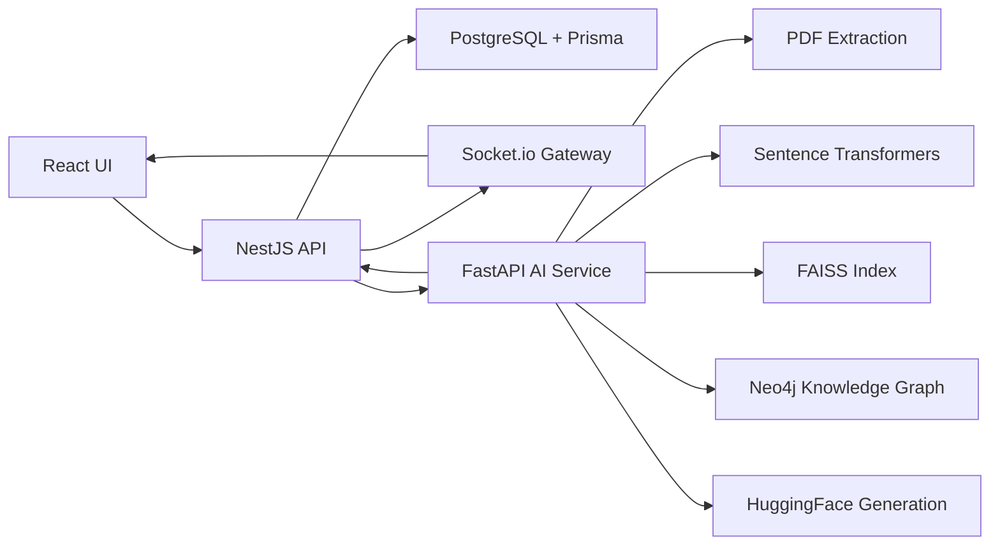

# DocLens AI Intelligence Layer

This document defines the AI microservice and backend integration that turns DocLens from a document management application into a knowledge graph-driven research intelligence platform.

## 1. Complete AI Architecture

DocLens keeps the existing React, NestJS, PostgreSQL, Prisma, JWT, upload, workspace, collection, viewer, notes, analytics, and WebSocket architecture. The AI layer is added as a separate Python service.



Core ownership:

- React renders existing product surfaces: papers, chat, analytics, and Knowledge Explorer.
- NestJS owns authentication, authorization, user scoping, durable records, WebSocket fanout, and calls to the AI service.
- FastAPI owns document intelligence: extraction, chunking, embeddings, vector retrieval, graph extraction, hybrid retrieval, and answer generation.
- PostgreSQL stores application state, AI metadata, query/citation history, and graph metadata needed by the app.
- FAISS stores dense vector indexes.
- Neo4j stores traversable research entities and relationships.

## 2. Folder Structure

Current integration points:

```text
ai-service/
  run.py
  requirements.txt
  app/
    main.py
    config.py
    api/
      health.py
      ingest.py
      search.py
      query.py
      graph.py
    core/
      pdf.py
      chunker.py
      embedder.py
      index.py
      rag.py
      graph_builder.py
    db/
      neo4j.py
    models/
      schemas.py

backend/src/
  ai-proxy/
    ai-proxy.module.ts
    ai-proxy.service.ts
  documents/
    documents.controller.ts
    documents.service.ts
  gateway/
    events.gateway.ts
  graph/
    graph.controller.ts
    graph.service.ts
  internal/
    internal.controller.ts
    internal.module.ts
  query/
    query.controller.ts
    query.service.ts

backend/prisma/
  schema.prisma

docs/
  AI_INTELLIGENCE_LAYER.md
```

Recommended next production folders:

```text
ai-service/app/jobs/          # queue workers and retry orchestration
ai-service/app/db/postgres.py # optional direct chunk metadata persistence
ai-service/app/eval/          # retrieval and answer quality tests
ai-service/app/prompts/       # versioned RAG/comparison prompts
ai-service/app/observability/ # traces, timings, token/citation metrics
```

## 3. FastAPI Service Design

Service responsibilities:

- Accept document processing jobs from NestJS.
- Extract text and metadata from PDFs.
- Create semantic chunks with page provenance.
- Generate normalized embeddings with Sentence Transformers.
- Store vectors in FAISS with metadata sidecars.
- Extract concepts, methods, datasets, metrics, models, and authors.
- Write entity relationships into Neo4j.
- Serve semantic search, hybrid retrieval, citation QA, comparison, graph exploration, and insights.
- Send progress callbacks to NestJS for WebSocket updates.

Runtime settings:

```text
AI_SERVICE_URL=http://localhost:8000
NESTJS_CALLBACK_URL=http://localhost:3001/api/v1/internal/ai-callback
INTERNAL_API_SECRET=doclens-internal-secret
MODEL_NAME=all-MiniLM-L6-v2
FAISS_INDEX_PATH=./data/faiss.index
NEO4J_URI=bolt://localhost:7687
NEO4J_USER=neo4j
NEO4J_PASSWORD=...
```

## 4. Retrieval Pipeline

Vector retrieval:

1. Receive query and collection scope.
2. Generate query embedding with the same Sentence Transformer model.
3. Search FAISS using cosine similarity through normalized vectors.
4. Filter by collection and optional document IDs.
5. Return chunks, source paper titles, page numbers, chunk indexes, vector IDs, and scores.

Semantic search examples:

- "transformer limitations"
- "time series anomaly detection"
- "retrieval augmented generation"

Returned evidence always includes enough provenance for the PDF viewer to jump to the relevant page and for chat citations to display source snippets.

## 5. Knowledge Graph Pipeline

Per processed paper:

1. Extract metadata: title, authors, page count, abstract.
2. Extract entities:
   - `AUTHOR`
   - `CONCEPT`
   - `METHOD`
   - `DATASET`
   - `METRIC`
   - `MODEL`
3. Create a `Paper` node in Neo4j.
4. Upsert entity nodes scoped by collection.
5. Add paper-to-entity relationships such as `HAS_CONCEPT`, `HAS_METHOD`, `HAS_DATASET`, `HAS_METRIC`, `HAS_MODEL`, and `AUTHORED_BY`.
6. Add entity-to-entity relationships such as `USES`, `EVALUATED_ON`, `REPORTS`, and `COMPARED_WITH`.
7. Store confidence and document provenance on relationships.

Example graph shape:

```text
Paper
  HAS_MODEL -> Transformer
  HAS_CONCEPT -> Attention
  HAS_DATASET -> GLUE

Transformer
  USES -> Attention
  COMPARED_WITH -> LSTM
  EVALUATED_ON -> GLUE
```

## 6. Hybrid Retrieval Architecture

Hybrid retrieval combines dense vector recall with graph traversal:

```text
Query
  -> Vector search in FAISS
  -> Entity match in Neo4j
  -> Graph-linked document discovery
  -> Evidence chunk aggregation
  -> Score blending and deduplication
  -> Citation-aware answer generation
```

Why this improves over pure vector retrieval:

- Vector search finds semantically similar chunks even when terms differ.
- Graph search finds related concepts, models, methods, datasets, and papers that may not share the exact query wording.
- Evidence aggregation boosts chunks supported by both vector similarity and graph connectivity.
- The system can discover adjacent evidence, such as papers connected through shared datasets or compared methods.

Scoring strategy:

- Vector-only chunks receive a dense similarity score.
- Graph-only chunks receive a graph evidence score based on entity matches.
- Chunks found by both channels receive a blended score and retain `retrieval_path: ["graph", "vector"]`.

## 7. Database Schema Changes

The Prisma schema adds durable AI metadata while leaving vector payloads in FAISS and graph traversal in Neo4j.

Added or expanded models:

- `DocumentChunk`: exact source chunks with page number, chunk index, vector ID, token count, and hash.
- `EmbeddingMetadata`: model, provider, dimensions, vector store, vector ID, and chunk/document links.
- `ChatSession`: scoped research conversations.
- `Query`: question, answer, model, latency, retrieval mode, raw request.
- `Citation`: exact answer-to-chunk links with relevance, page, title, and source text.
- `Entity`: normalized concepts, methods, datasets, metrics, models, authors.
- `DocumentEntity`: document-to-entity mentions with confidence and pages.
- `Relationship`: typed entity relationships with collection, document, optional evidence chunk, confidence, and metadata.

Primary storage split:

- PostgreSQL: app records, query history, citations, AI metadata, graph metadata for app queries.
- FAISS: vector payload and similarity index.
- Neo4j: traversable research graph and relationship expansion.

## 8. API Contracts

NestJS public API:

```http
POST /api/v1/documents/upload
GET  /api/v1/query/status/:documentId
POST /api/v1/query/search
POST /api/v1/query/hybrid-search
POST /api/v1/query/ask
POST /api/v1/query/summarise
POST /api/v1/query/compare
GET  /api/v1/graph/entities?collectionId=...
GET  /api/v1/graph/discover?collectionId=...&query=...
POST /api/v1/graph/expand
GET  /api/v1/graph/insights?collectionId=...
```

FastAPI internal API:

```http
POST /ingest/process
GET  /ingest/status/{document_id}
POST /search
POST /search/semantic
POST /search/hybrid
POST /query/ask
POST /query/summarise
POST /query/compare
GET  /graph/entities
GET  /graph/discover
POST /graph/expand
GET  /graph/insights
GET  /health
```

Example QA request from NestJS to FastAPI:

```json
{
  "question": "What are the limitations of this approach?",
  "collection_id": "collection-uuid",
  "session_id": "session-uuid",
  "top_k": 5,
  "retrieval_mode": "hybrid",
  "document_ids": ["optional-document-uuid"]
}
```

Example QA response:

```json
{
  "answer": "The uploaded papers indicate ... [Source 1]",
  "citations": [
    {
      "document_id": "paper-uuid",
      "document_title": "Paper Title",
      "page_number": 4,
      "chunk_index": 12,
      "chunk_text": "Source excerpt...",
      "score": 0.87,
      "retrieval_path": ["graph", "vector"]
    }
  ],
  "latency_ms": 421,
  "model_used": "google/flan-t5-base",
  "retrieval_mode": "hybrid"
}
```

WebSocket events:

```text
document:uploaded
document:status
document:deleted
```

Processing stages:

```text
UPLOADED -> EXTRACTING -> CHUNKING -> EMBEDDING -> INDEXING -> READY
```

NestJS maps `READY` to the existing frontend-ready `COMPLETED` state to avoid redesigning current UI logic.

## 9. Deployment Architecture

Development:

```text
React Vite:    localhost:5173
NestJS API:    localhost:3001
FastAPI AI:    localhost:8000
PostgreSQL:    localhost:5432
Neo4j:         localhost:7687 / browser 7474
```

Production service layout:

```text
frontend
backend-api
ai-api
ai-worker
postgres
neo4j
shared-object-storage
faiss-volume
```

Deployment notes:

- Keep FastAPI private to the backend network.
- Only NestJS should call the AI service.
- Use the internal secret header for callbacks.
- Mount a persistent volume for FAISS indexes and metadata sidecars.
- Store original PDFs in object storage or a shared upload volume available to AI workers.
- Run processing jobs through a durable queue for production, such as BullMQ, Celery, Dramatiq, or a managed queue.
- Add observability for stage timings, chunk counts, embedding latency, retrieval mode, citation count, and generation latency.

## 10. Step-by-Step Implementation Plan

1. Finalize environment configuration for NestJS, FastAPI, Postgres, Neo4j, and FAISS volumes.
2. Run Prisma migration for the new AI metadata schema.
3. Replace the in-memory document store with Prisma-backed document, chunk, query, citation, entity, and relationship writes.
4. Make document upload enqueue a durable processing job instead of relying on in-process background tasks.
5. Persist chunk metadata and embedding metadata from the AI service callback or through a secure internal chunk sync endpoint.
6. Add robust PDF extraction fallbacks for image-only papers through OCR.
7. Upgrade entity extraction from regex heuristics to a domain NER/relation extraction pipeline.
8. Add hybrid retrieval evaluation sets and compare vector-only vs graph-enhanced answer quality.
9. Add Knowledge Explorer entity autocomplete through `/graph/discover`.
10. Add collection-level intelligence jobs for concept evolution, related concepts, influential methods, and connected components.
11. Add answer quality safeguards: citation coverage checks, unsupported-claim detection, and source-only generation prompts.
12. Add production queue retries, poison-job handling, and reindexing tools for model upgrades.
